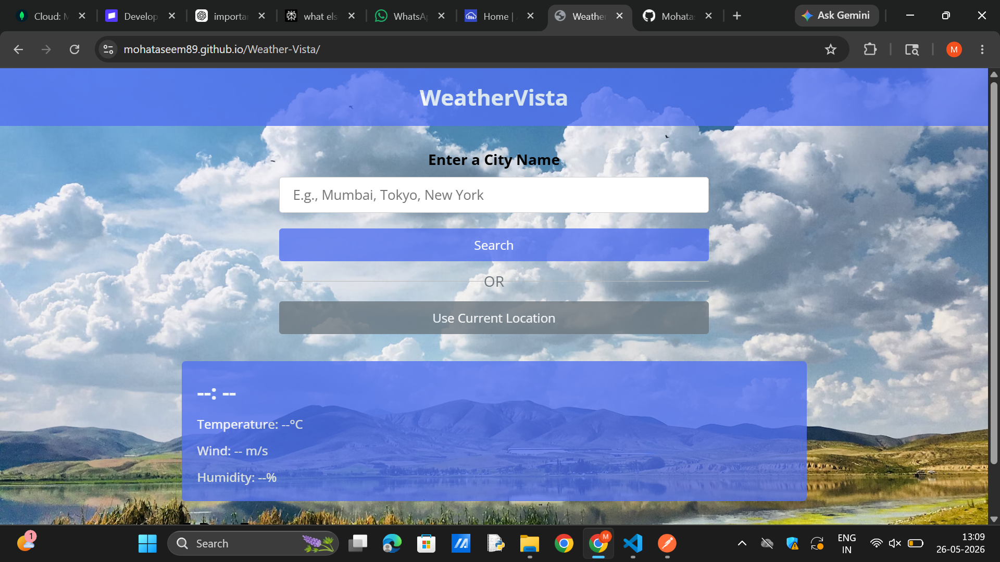
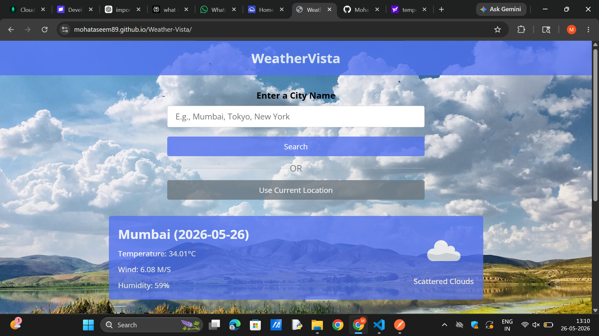
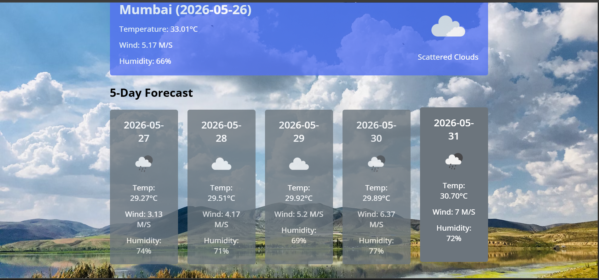

# WEATHER-VISTA

WeatherVista is a sleek and responsive weather web app built with HTML, CSS, and JavaScript. It provides real-time weather updates for any location, showing details like temperature, humidity, wind speed, and weather conditions.

## Features

- Live weather data using API integration
- Search by city to fetch current weather details
- Dynamic backgrounds based on weather conditions
- Clean and modern UI with smooth animations
- Responsive design for mobile, tablet, and desktop

## Live Demo

Visit the project here: [WeatherVista](https://mohataseem89.github.io/Weather-Vista/)

## Screenshots

### Home Page

### Mumbai Weather

### 5-Day Forecast

---

##  Author

**Mohataseem Khan**
 Connect with me: [LinkedIn](https://www.linkedin.com/in/mohataseem-khan/) • [GitHub](https://github.com/Mohataseem89)

---
